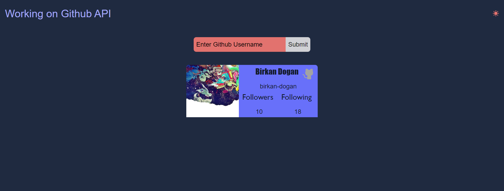

# Working On GithubAPI 🤙

## Table of contents

- [Summary](#summary)
- [Screenshot](#screenshot)
- [Link](#link)
- [Built with](#built-with)
- [Utility Links](#utility-links)

## Summary

> **The project aim was that learning how to use axios library to fetch data from external api and making routing to show data in different pages. Also, using relevelant components together has made the project really powerful and fun in some many reasons..**

- I have worked with HTML, SCSS, JavaScript, React.js to create this good-looking fully-responsive interactive page 🎯.
- I've used the advantages of React.js to manipulate the DOM efficiently 🎢.
- I like working with **Context-API** to manipulate theme settings ☀ 🌑.
- In CSS process, I've used SCSS and SCSS helps me to control all color variables and breakpoints for responsive design in one place. Thanks to nested structure of SCSS, I wrote less code in main parts 🌌.
  > **What's next?**
- I want to use api's pagination end-point, and for that I will built custom pagination.

## Link

<a href="https://workingongithubapi.vercel.app/">Live Version of the project</a>

## Screenshot

## Built with

- HTML
- SCSS
- JavaScript
- React.js

## Utility Links

> [Sass](https://sass-lang.com/)  
> [JavaScript](https://developer.mozilla.org/en-US/docs/Web/JavaScript)  
> [React.js](https://beta.reactjs.org/)  
> [Context-API](https://blog.logrocket.com/react-context-api-deep-dive-examples/)

 Keep Building 🚀

